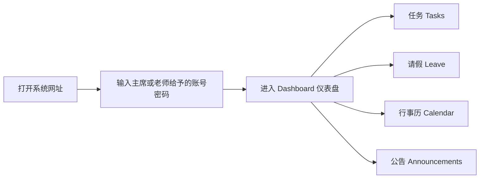
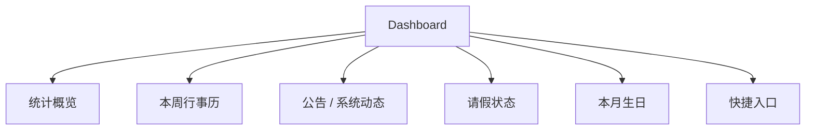
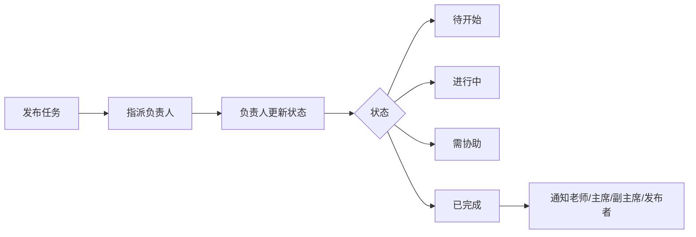
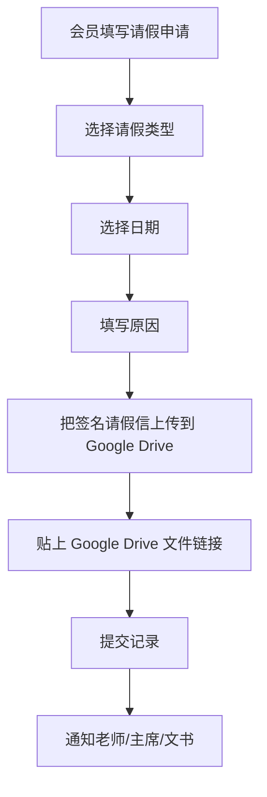
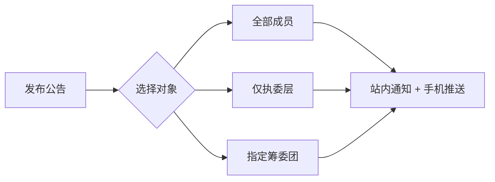
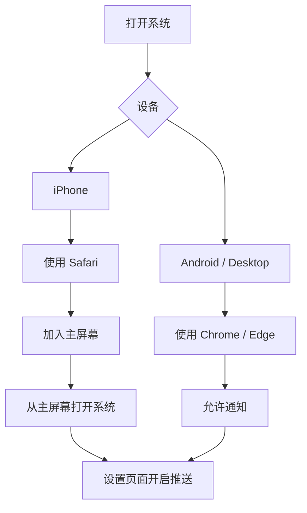
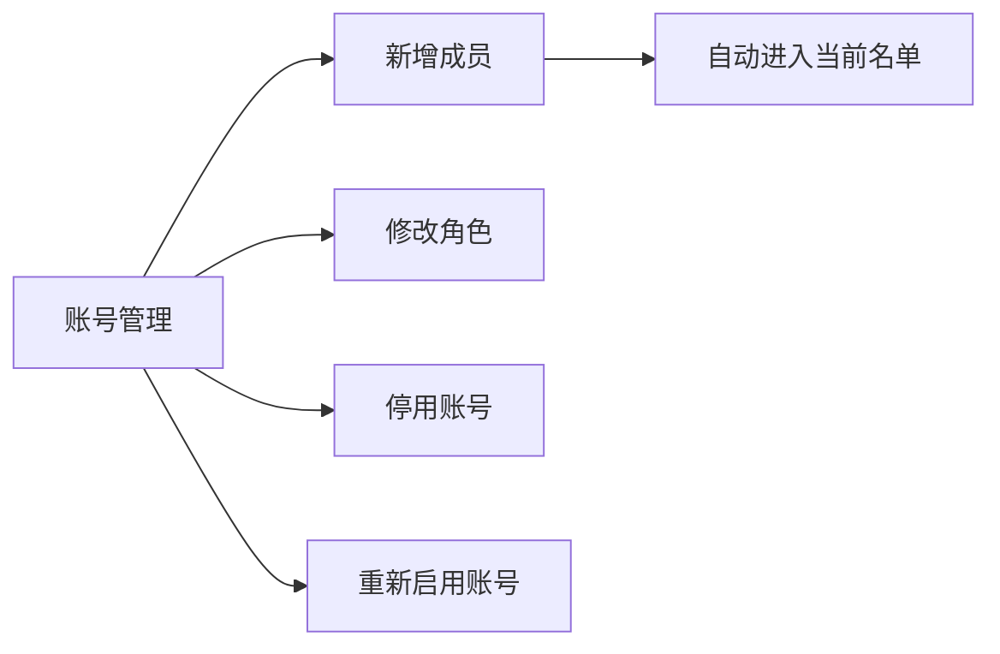
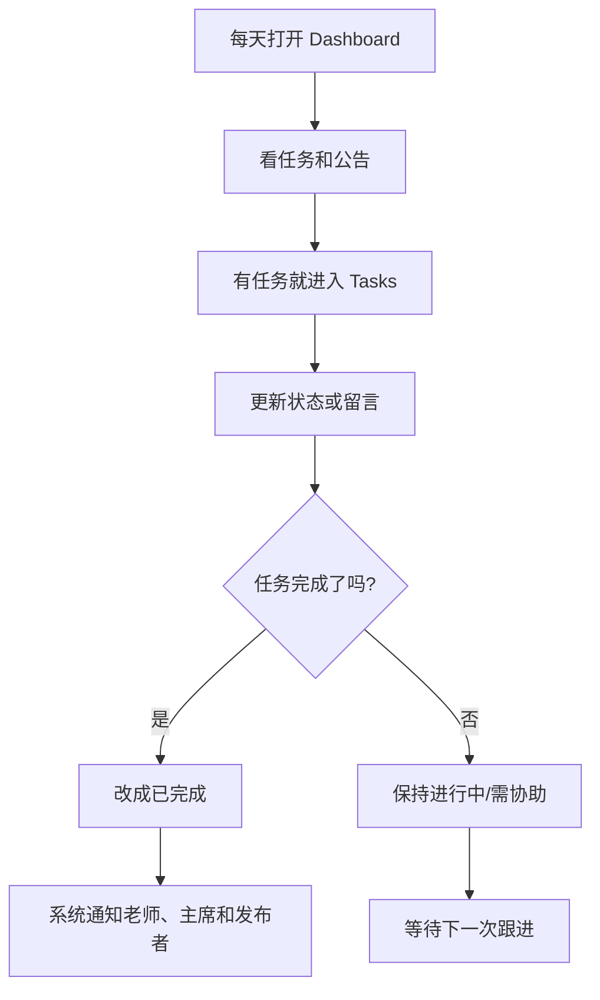

# CHMS1 Chinese Language Club System 用户指南

> 适用于一中华文学会 CLC_sys。  
> 本指南给召集老师、指导老师、主席、副主席、文书、执委层、筹委与普通会员使用。

---

## 1. 系统入口

首次登入请使用主席或老师给予的账号与密码。登入后建议先到「设置」开启 PWA 手机推送。

---

## 2. 角色权限总览

| 功能 | 普通会员 | 筹委成员 | 执委层 | 文书/副文书 | 主席/副主席 | 指导/召集老师 |
|---|---:|---:|---:|---:|---:|---:|
| 查看自己的任务 | ✅ | ✅ | ✅ | ✅ | ✅ | ✅ |
| 发布任务 | ❌ | 依权限 | ✅ | ✅ | ✅ | ✅ |
| 查看成员任务表现 | ❌ | ❌ | ❌ | ❌ | ✅ | ✅ |
| 提交请假 | ✅ | ✅ | ✅ | ✅ | ✅ | ✅ |
| 查看请假记录 | 自己 | 自己 | 自己 | 全部 | 全部 | 全部 |
| 检查请假 | ❌ | ❌ | ❌ | ✅ | ✅ | ✅ |
| 管理成员账号 | ❌ | ❌ | ❌ | ❌ | ✅ | ✅ |
| 发布公告 | ❌ | ❌ | ❌ | ❌ | 主席 | ✅ |
| 查看行事历 | ✅ | ✅ | ✅ | ✅ | ✅ | ✅ |

---

## 3. Dashboard 仪表盘

Dashboard 是系统首页，用来快速查看重点事项。

### 常用快捷入口

| 快捷入口 | 谁会看到 | 用途 |
|---|---|---|
| 我的任务 / 新建任务 | 任务管理者 | 进入任务页面 |
| 提交请假 | 所有人 | 提交请假记录 |
| 查看行事历 | 所有人 | 查看活动、会议、截止日期 |
| 检查请假 | 文书、副文书、主席、老师 | 查看请假记录 |
| 管理成员 | 召集老师、指导老师、主席、副主席 | 管理账号与身份 |
| 发布公告 | 召集老师、指导老师、主席 | 发布系统公告 |

---

## 4. 任务 Tasks

任务页面是工作追踪中心。

### 任务状态

| 状态 | 意思 | 建议用法 |
|---|---|---|
| 待开始 | 还没有开始处理 | 刚分配任务时 |
| 进行中 | 已经开始处理 | 正在制作、整理、联系 |
| 需协助 | 遇到问题 | 需要老师/主席/负责人帮忙 |
| 已完成 | 已完成交付 | 任务负责人完成后更新 |

### 任务优先级提醒

| 优先级 | 提醒规则 |
|---|---|
| 高 | 截止前 14 天开始提醒，每 3 天一次；最后 3 天若还未开始，每天提醒 |
| 中 | 截止前 7 天、4 天、1 天提醒 |
| 低 | 截止前 1 天、当天提醒 |
| 逾期 | 逾期后一律每天提醒 |

### 普通会员看到什么？

普通会员只会看到：

- 自己所属的团队
- 自己被分配到的任务
- 自己任务的状态与留言

普通会员不会看到：

- 别人的完整任务
- 成员任务表现统计
- 管理成员入口

### 成员任务表现

只有召集老师、指导老师、主席、副主席可查看。

| 指标 | 说明 |
|---|---|
| 总任务数 | 该成员被分配的任务数量 |
| 完成数 | 已完成任务数量 |
| 进行中 | 正在处理的任务 |
| 待做 | 尚未开始的任务 |
| 逾期 | 已超过截止日期的任务 |
| 完成率 | 已完成 / 总任务 |
| 标签 | 积极 / 稳定 / 需跟进 |

---

## 5. 请假 Leave

请假模块用于记录已经获得签名的请假信。

### 请假类型

| 类型 | 说明 |
|---|---|
| 病假 | 生病无法出席 |
| 公假 | 学校/正式事务 |
| 事假 | 私人原因 |
| 自定义 | 手动输入类型 |

### 附件提醒

请务必上传已获得指导老师、主席及文书签名的请假信。未签名的请假信将不予受理。

---

## 6. 行事历 Calendar

行事历记录学会活动、内部会议与截止日期。

| 颜色 | 类型 | 自动提醒 |
|---|---|---|
| 蓝色 | 学会活动 | 7 天前、3 天前、1 天前 |
| 绿色 | 内部会议 | 7 天前、3 天前、1 天前 |
| 红色 | 任务截止日期 | 由任务提醒规则处理 |

新增活动时可以选择：

- 所有会员可见
- 执委层
- 指定筹委

行事历默认让登入会员查看；团队选择主要用于内部归档。

---

## 7. 公告 Announcements

公告用于发布系统通知、活动通知、重要事项。

公告发布对象：

| 对象 | 谁会看到 |
|---|---|
| 全部成员 | 所有启用账号 |
| 仅执委层 | 老师、主席、副主席、执委层角色 |
| 指定筹委团 | 该筹委成员 |

公告可以修改或删除。删除公告时，相关站内通知也会同步处理。

---

## 8. PWA 手机推送

手机推送用于接收任务、公告、请假、生日祝福等通知。

### iPhone 注意事项

- 必须使用 Safari
- 必须「加入主屏幕」
- 必须从主屏幕打开系统
- 设置页面开启推送

如果退出登入，手机仍可能收到通知，因为推送 token 仍然存在。若不想收到，需要在设置里关闭通知。

---

## 9. 账号与换届

账号由老师、主席或副主席管理。

换届时：

- 老师或主席选择要停用的账号
- 不会自动全部封锁
- 主席也可能被停用，因为主席会换人
- 普通会员也纳入名单，不只处理执委层

---

## 10. 常见问题

### 为什么没有收到手机通知？

检查：

1. 是否安装 PWA
2. 是否允许浏览器通知
3. 设置页面是否开启推送
4. `fcm_token` 是否存在
5. Edge Function schedule 是否有运行
6. 通知是否只建立站内通知但没有推送

### 为什么任务截止没提醒？

检查：

1. `task-deadline-reminder` schedule 是否存在
2. Function logs 是否有 `401`
3. 任务是否有截止日期
4. 任务是否已完成
5. 任务是否分配给正确成员
6. 同一天是否已经提醒过

### 为什么普通会员看不到某些任务？

这是正常权限设计。普通会员只看自己相关任务，避免看到其他成员的工作内容。

---

## 11. 建议日常使用流程

---

## 12. 发布前管理员检查表

| 检查项目 | 状态 |
|---|---|
| Supabase schedule 已设置 | ☐ |
| PWA 推送测试成功 | ☐ |
| 任务提醒测试成功 | ☐ |
| 公告推送测试成功 | ☐ |
| 请假记录可提交 | ☐ |
| 普通会员权限正确 | ☐ |
| 文书看不到管理成员 | ☐ |
| GitHub 已 push 最新代码 | ☐ |

